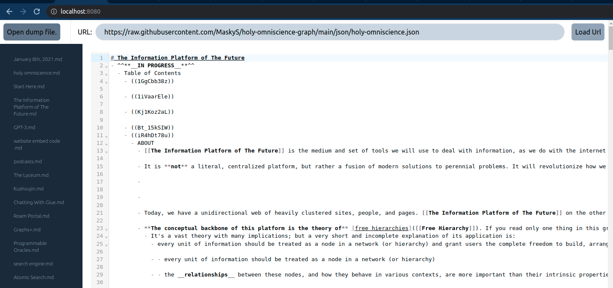
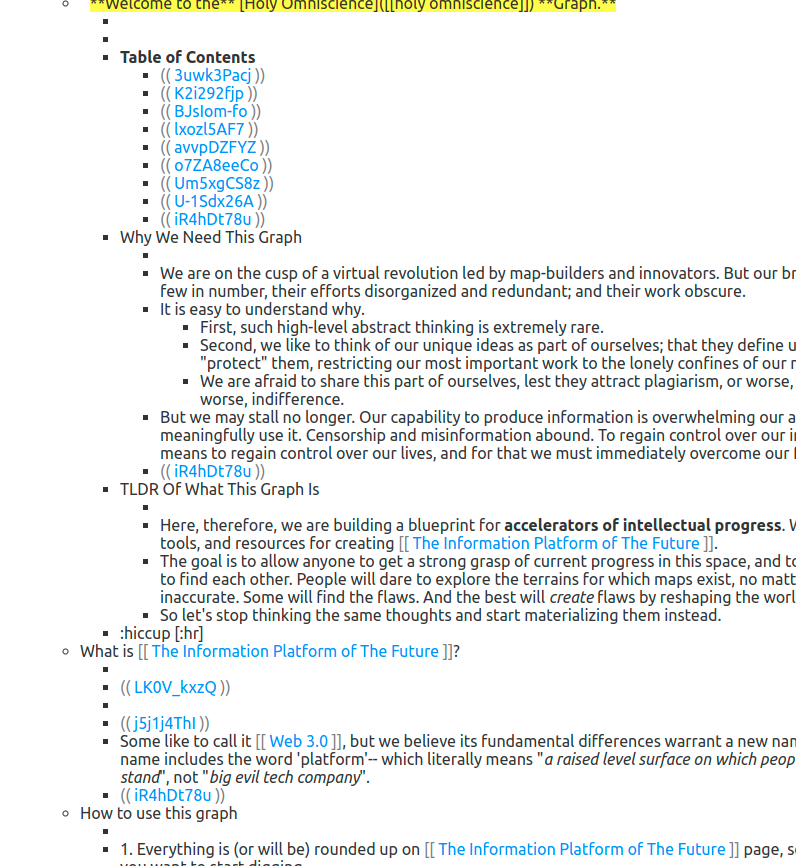
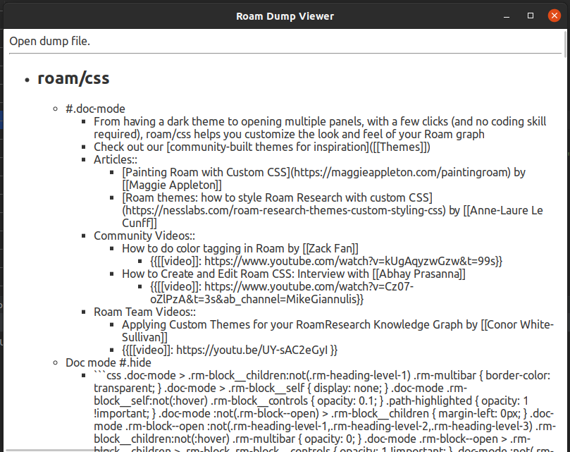

# whalerust

Experimental note-taking app inspired by roamresearch, obsidian, dendron, logseq etc.

Personal project get to know learn rust, wasm and svelte.



## Development

### setup 

install `cargo`, `yarn`, [tauri](https://tauri.studio/docs/getting-started/setting-up-linux)


1. run `cargo test` (required for generating typescript bindings)
2. `wasm-pack build whale_rust_wasm/` 
3. run `cargo run --package server --bin main path/to/your/roam_dump.json` 
4. run `yarn dev` to actual frontend (and proxying to the rust server)
5. run `yarn tauri dev`  (while `yarn dev` is running)

### tauri release

```
yarn install
wasm-pack build whale_rust_wasm/
yarn build
yarn tauri build
```

## Dev-Diary

### 2022.03.13


 - Switched from block-based rendering to full markdown editor like [obsidian](https://obsidian.md/) by using [codemirror](https://codemirror.net/6/) editor library.
   - the roam-block parser might still come in handy in for converting roam-blocks to markdown later - so far markdown conversion is very basic
   - added `[[WikiLink]]`-Syntax to the codemirror base markdown support
   - added some styling via [tailwindcss](https://tailwindcss.com/)
 - idea:
   - would love to go beyond personal note taking - to go [collaborative](https://gist.github.com/Davidiusdadi/df608c0c92f84d135308f82af68ecc97) - by using [holochain](https://holochain.org/) - which was what drew me to rust in the first place.

### 2022.03.04



- using rust [pest](https://pest.rs/)  PEG parser to parse roam-specific syntax 
  - highlighting `[[page references]]` and `((block-references))`

### 2022.02.17



- [svelte](https://svelte.dev/) rendered [tauri](https://tauri.studio/) app 
- [roamresearch](https://roamresearch.com/) json dump parsed via rust [serde](https://serde.rs/)
- 
- rust code is loaded as wasm


### 2022.01.28

 time to learn `[[rust]]` for real - 4 that i need a `[[project]]` to start building - lets call it `[[whalerust]]`
 - the goal is to
    - create a `[[roamresearch]]` dump viewer
    - create a `[[wasm]]` and serve it to a webpage
